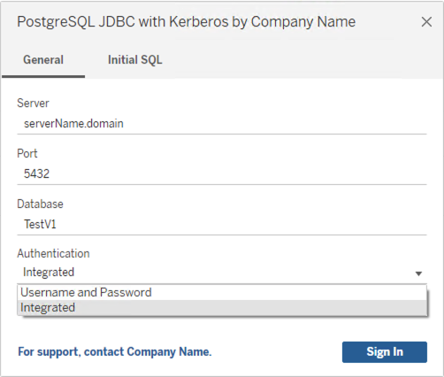
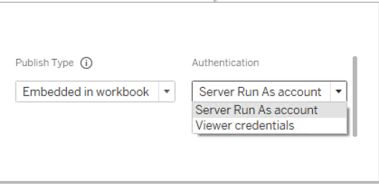

# Readme

The postgres jdbc kerberos sample connector plugin demonstrates how to incorporate different kerberos-based authentication modes for your "Tableau + Postgres + JDBC" use cases. This sample plugin code has been tested for all the authentication methods listed here with all platforms (Mac Desktop, Windows Desktop and Server, Linux Server). However, the individual sections of the plugin components concern specific authentication modes and have been laid out here for the purposes of understanding and re-use. While publishing from Tableau Desktop, the Server RunAs and Viewer credentials authentication options will be visible in publish dialog only if you have logged into tableau using Integrated Authentication. 

Contents
1. [Use case(s) of this connector plugin](#purpose)
1. [Introduction to Kerberos on Java](#intro) 
1. [Kerberos SSO for Tableau Desktop](#desktop)
1. [Kerberos RunAs and Delegation on Server](#server).


## <a id="purpose"/> Use case(s) of this connector plugin
1. Use **SSPI** authentication to connect a postgres database with `Tableau Desktop on Windows`   
1. Use **Kerberos SSO via GSS-API** to connect a postgres database with `Tableau Desktop on Mac`.
1. Publish a viz from `Tableau Desktop` using **Server RunAs authentication** and open it in Tableau Server. In this scenario, Tableau Server connects to databases with a service account.
1. Publish a viz from `Tableau Desktop` using **Kerberos Delegation/Viewer Credentials authentication** and open it in Tableau Server. When a user accesses this viz on Tableau Server, the impersonation_runas_principal would be used to delegate queries to the tableau server user. 

Below I give a brief introduction on how Java uses GSS-API to implement Kerberos authentication.

## <a id="intro"> Introduction to Kerberos on Java

### GSS-API
GSS-API offers application programmers uniform access to security services atop a variety of underlying security mechanisms, including Kerberos. The GSSAPI, by itself, does not provide any security. Instead, security-service vendors provide GSSAPI implementations - usually in the form of libraries installed with their security software. These libraries present a GSSAPI-compatible interface to application writers who can write their application to use only the vendor-independent GSSAPI. If the security implementation ever needs replacing, the application need not be rewritten. The dominant GSSAPI mechanism implementation in use is Kerberos. (source - [wikipedia](https://en.wikipedia.org/wiki/Generic_Security_Services_Application_Program_Interface))
All the authentication modes described below use some flavor of GSS-API with Kerberos implementation. 

#### SSPI authentication
Security Support Provider Interface (SSPI) is a proprietary variant of GSSAPI with extensions and very Windows-specific data types. It is a Win32 API used by Microsoft Windows systems to perform a variety of security-related operations such as authentication. SSPI functions as a common interface to several Security Support Providers (SSPs). A Security Support Provider is a dynamic-link library (DLL) that makes one or more security packages available to application.
Examples of common SSPs are Kerberos, NTLM, Negiotiate. (source - [wikipedia](https://en.wikipedia.org/wiki/Security_Support_Provider_Interface)). 

In simple words - SSPI is used to configure Single Sign-on type of authentication to connect to a database using your Active Directory credentials. Tableau Desktop uses [native GSS-API](https://docs.oracle.com/en/java/javase/11/security/accessing-native-gss-api.html) interface for SSPI/SSO using Kerberos.

#### JAAS and Java GSS-API

JAAS(Java Authentication and Authorization Service) can be used for two purposes:

-   for authentication of users, to reliably and securely determine who is currently executing Java code, and
-   for authorization of users to ensure they have the access control rights (permissions) required to do security-sensitive operations.

Java GSS-API is used for securely exchanging messages between communicating applications. The Java GSS-API contains the Java bindings for the GSS-API defined in [RFC 5653](https://tools.ietf.org/html/rfc5653). 
(source - [Oracle Java docs](https://docs.oracle.com/en/java/javase/11/security/java-generic-security-services-java-gss-api1.html)).  

JAAS authentication is typically performed prior to secure communication using Java GSS-API. Tableau Server uses JAAS and JGSS for Server Runas and Kerberos Delegation authentication.

## <a id="desktop"></a>Kerberos SSO for Tableau Desktop

### SSPI authentication for Tableau Desktop on Windows
connection-fields.xml
```
<field name="authentication" label="Authentication" category="authentication" value-type="selection">
  <selection-group>
    <option value="auth-integrated" label="Integrated" />
    <!-- other auth options -->
  </selection-group>
</field>
```
connectionProperties.js
```
    props["gsslib"] = "gssapi";	 
    props["jaasLogin"] = "false";  
    props["jaasApplicationName"] = "com.sun.security.jgss.krb5.initiate";
```



### Kerberos SSO for Tableau Desktop on Mac
connection-fields.xml
```
<field name="authentication" label="Authentication" category="authentication" value-type="selection">
  <selection-group>
    <option value="auth-integrated" label="Integrated" />
    <!-- other auth options -->
  </selection-group>
</field>
```

connectionProperties.js
```
    props["jaasApplicationName"] = "com.sun.security.jgss.krb5.initiate";
    props["gsslib"] = "gssapi";	 
    props["jaasLogin"] = "false";  
```

Other Configuration:
* Only for postgres jdbc plugin on Mac - add this property `Settings.DisableNativeGSS` as a `Boolean/YES` to the Tableau plist on Mac at `/Library/Preferences/com.tableau.Tableau-<version>.plist` as described below. Here version is Tableau Desktop major version, for example, `com.tableau.Tableau-2020.4.plist`.
```
// Note - the below command requires root privileges hence sudo is needed.
sudo defaults write /Library/Preferences/com.tableau.Tableau-<version>.plist Settings.DisableNativeGSS -bool YES
```
* Make sure a krb5.conf file is present at `/etc/krb5.conf`(/etc is a private directory, requires root privileges). Check for the existence of either of the following two files `/etc/krb5.conf` or `/Library/Preferences/edu.mit.Kerberos`. If the second file (edu.mit.Kerberos) is present it needs to be backed up and deleted.
* Before connecting, run `klist` to verify kerberos TGT for the user principal is present in the kerberos ticket cache. If not, run `kinit user@REALM` before opening Tableau Desktop.  


## <a id="server"/> Kerberos RunAs and Delegation on Server
When a user logs into Tableau desktop using Integrated authentication, there are the two publish options available for Kerberos authentication, namely, "Server run-as" and "Viewer Credentials/Kerberos Delegation".



### Server RunAs authentication
You can configure Tableau Server to use a Kerberos service account to access a database. In this scenario, Tableau Server connects to databases with a service account, also referred to as a "RunAs account". 
For Server RunAs authentication, users need to provide a user principal name and a keytab file path. Tableau Server uses the keytab to login to kerberos KDC using JAAS and the TGT thus obtained is used by jdbc driver for making a database connection.
For configuring a Linux Server see this Tableau [article](https://help.tableau.com/current/server-linux/en-us/kerberos_runas_linux.htm). For configuring a Windows Server see this Tableau [article](https://help.tableau.com/current/server/en-us/kerberos_runas_jdbc.htm). 
These are the plugin code changes required to support Server RunAs authentication on Tableau Server.

connectionProperties.js
```
    function isEmpty(str) {
        return (!str || 0 === str.length); 
    }

    if (attr[connectionHelper.attributeAuthentication] == "auth-integrated") {
        // if attributeTableauServerUser is non-empty, it means the connector plugin is currently being accessed in a tableau server environment
        var serverUser = attr[connectionHelper.attributeTableauServerUser];
        if (!isEmpty(serverUser)) {
            props["user"] = serverUser;
            props["gsslib"] = "gssapi";  
            props["jaasLogin"] = "false";    
        }   
```

### Viewer Credentials authentication

Kerberos delegation enables Tableau Server to use the Kerberos credentials of the viewer of a workbook or view to execute a query on behalf of the viewer. This is useful in the following situations:
* You need to know who is accessing the data (the viewer's name will appear in the access logs for the data source).
* Your data source has row-level security, where different users have access to different rows

While configuring Tableau Server for kerberos delegation, users need to provide impersonation_runas_principal and keytab which will be used to impersonate the viewer. For configuring Kerberos delegation on Tableau Server for Linux, refer to this [article](https://help.tableau.com/current/server-linux/en-us/kerberos_delegation.htm). For configuring Kerberos delegation for Tableau Server on Windows, refer to this [article](https://help.tableau.com/current/server/en-us/kerberos_delegation_jdbc.htm) 

These are the plugin code changes required to support Kerberos Delegation on Tableau Server.

connectionProperties.js
```
    function isEmpty(str) {
        return (!str || 0 === str.length); 
    }

    if (attr[connectionHelper.attributeAuthentication] == "auth-integrated") {
        // if attributeTableauServerUser attribute is non-empty, it means the connector plugin is currently being accessed in a tableau server environment
        var serverUser = attr[connectionHelper.attributeTableauServerUser];
        if (!isEmpty(serverUser)) {
            props["user"] = serverUser;
            props["gsslib"] = "gssapi";  
            props["jaasLogin"] = "false";    
        }   
```
manifest.xml
```
<!-- This capability is needed to support kerberos delegation on tableau server --> 
      <customization name="CAP_AUTH_KERBEROS_IMPERSONATE" value="yes"/>
```


